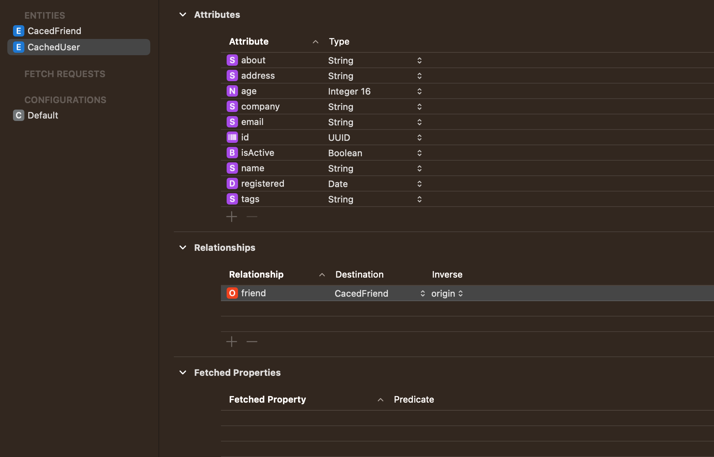
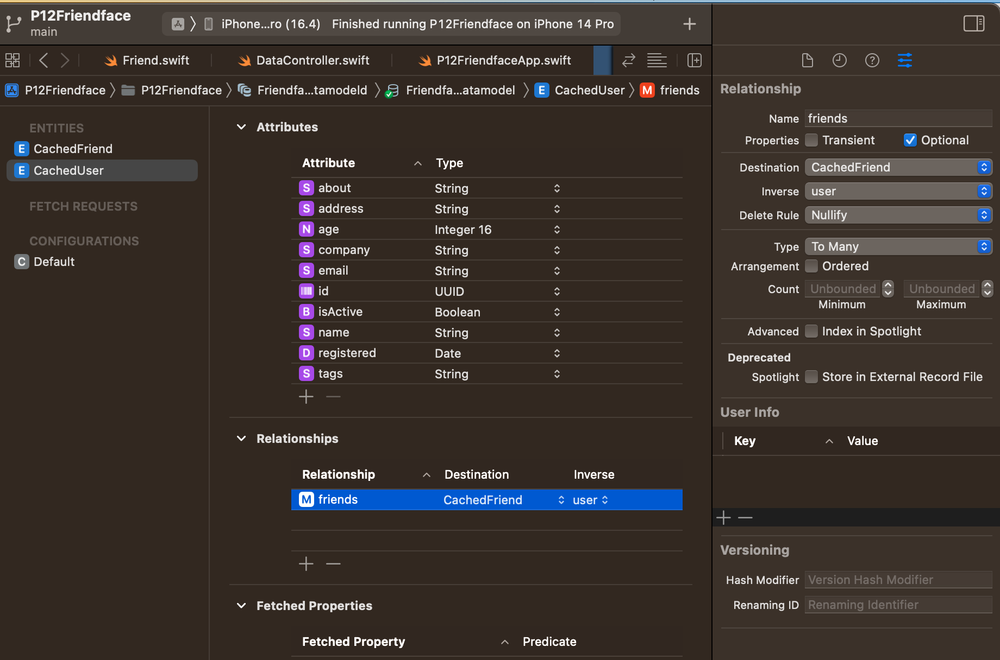

# How to store data in Core Data?

1. Create a data model file (`.xcdatamodeld`).

CMD-N -> Core Data -> Data Model

2. Create an entity.

3. Create attributes.

4. Define relationships.



Don't forget change relationship type in the Data Model Inspector.



4.2 Generate NSManagedObject subclass

Editor -> Create NSManagedObject subclass

5. Create data controller

add merge policy

```swift
import CoreData
import Foundation

class DataController: ObservableObject {
    let container = NSPersistentContainer(name: "Friendface")
    
    init() {
        container.loadPersistentStores { description, error in
            if let error = error {
                print("Core Data failed to load: \(error.localizedDescription)")
            }
        }

        container.viewContext.mergePolicy = NSMergeByPropertyObjectTrump
    }
}
```

6. Add unique constrains on id of CachedUser and CachedFriend

7. Config managed object context

```swift
import SwiftUI

@main
struct FriendfaceApp: App {
    @StateObject private var dataController = DataController()
    
    var body: some Scene {
        WindowGroup {
            ContentView()
                .environment(\.managedObjectContext, dataController.container.viewContext)
        }
    }
}

```

8. Add context in the `ContentView`

`@Environment(\.managedObjectContext) var moc`

9. Update Cache function

```swift
func updateCache(with downloadedUsers: [User]) {
    for user in downloadedUsers {
        let cachedUser = CachedUser(context: moc)

        cachedUser.id = user.id
        cachedUser.isActive = user.isActive
        cachedUser.name = user.name
        cachedUser.age = Int16(user.age)
        cachedUser.company = user.company
        cachedUser.email = user.email
        cachedUser.address = user.address
        cachedUser.about = user.about
        cachedUser.registered = user.registered
        cachedUser.tags = user.tags.joined(separator: ",")

        for friend in user.friends {
            let cachedFriend = CachedFriend(context: moc)
            cachedFriend.id = friend.id
            cachedFriend.name = friend.name
            cachedUser.addToFriends(cachedFriend)
        }
    }

    try? moc.save()
}
```

10. Add updateCache function in the loadData()

```swift
func loadData() async {
        guard users.isEmpty else { return }
        
        guard let url = URL(string: "https://www.hackingwithswift.com/samples/friendface.json") else {
            print("Invalid URL")
            return
        }
        
        do {
            let (data, _) = try await URLSession.shared.data(from: url)
            
            let decoder = JSONDecoder()
            decoder.dateDecodingStrategy = .iso8601
            let users = try decoder.decode([User].self, from: data)
            
            await MainActor.run {
                updateCache(with: users)
            }
            
        } catch {
            print("Invalid data")
        }
    }
```

