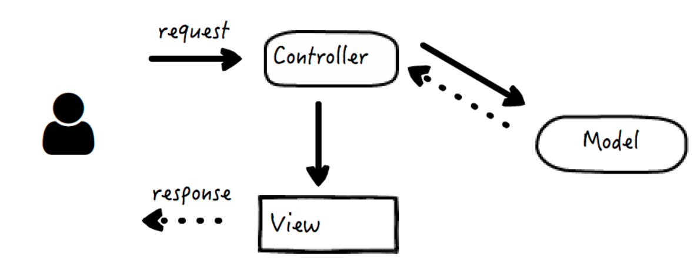
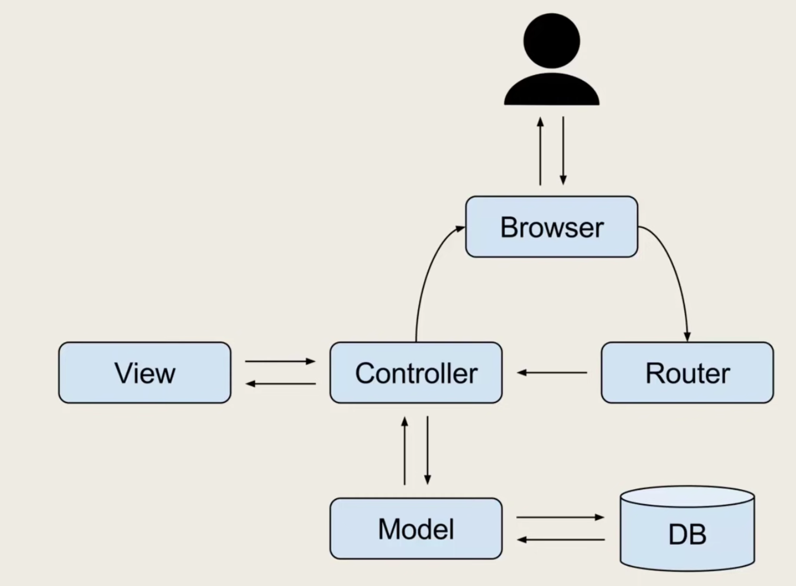
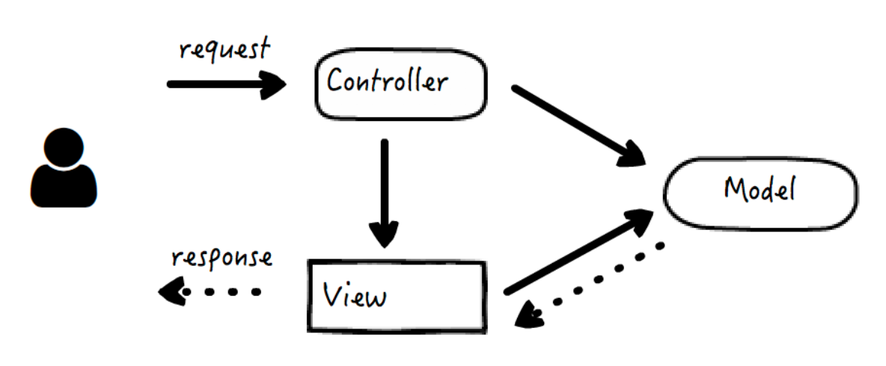
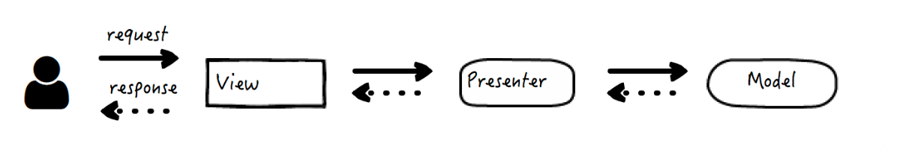

# MVC, MVP, and MVVM

MVC 的常见形式一：

数据由 Controller 调用 Model 来准备，并传递给 View 层；

MVC 的常见形式二：

Controller 发起对数据的修改，在 View 中查询修改后的数据并展示，二者分别调用 Model；

MVP

- Model 的职责没有太大的变化，依然是业务数据的唯一来源。
- View 变成了纯粹的被动视图，它被动地响应用户的操作来触发事件，并将其转交给 Presenter；反过来，它的视图界面被动地由 Presenter 来发起更新。
- Presenter 变成了 View 和 Model 之间的协调者（Middle-man），它是真正调度逻辑的持有者，会根据事件对 Model 进行状态更新，又在 Model 层发生改变时，相应地更新 View。

MVVM

MVVM 是在 MVP 的基础上，将职责最多的 Presenter 替换成了 ViewModel，它实际是一个数据对象的转换器，将从 Model 中取得的数据简化，转换为 View 可以识别的形式返回给 View。View 和 ViewModel 实行双向绑定

